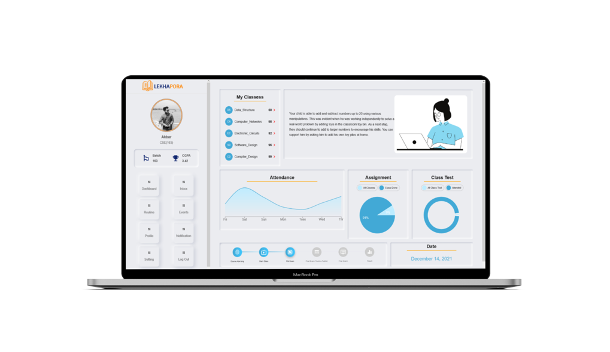

<!-- Improved compatibility of back to top link: See: https://github.com/othneildrew/Best-README-Template/pull/73 -->

<!--
*** Thanks for checking out the Best-README-Template. If you have a suggestion
*** that would make this better, please fork the repo and create a pull request
*** or simply open an issue with the tag "enhancement".
*** Don't forget to give the project a star!
*** Thanks again! Now go create something AMAZING! :D
-->

<!-- PROJECT LOGO -->
 

  

  <h3 align="center">Lekhapora Bangladesh</h3>

  

    Interdepartmental Communication System is a web-based application software designed to introduce a conducive and structured information exchange environment for integrating students and teachers of the university.
     
    <a href="https://github.com/WahidHoquee/lekhapora-bangladesh"><strong>Explore the docs »</strong></a>
     
     
    <a href="https://lekhapora.netlify.app/">View Demo</a>
    ·
    <a href="https://github.com/WahidHoquee/lekhapora-bangladesh/issues">Report Bug</a>
    ·
    <a href="https://github.com/WahidHoquee/lekhapora-bangladesh/issues">Request Feature</a>
  

<!-- ABOUT THE PROJECT -->
## About The Project

  

#### A Platform for Educational Institute  
It is a platform for sharing class notes, lectures, assignment management, progress management, events management, attendance management.
#### Learning Management System
This application is used for the management, delivery, monitoring and control education activities for any educational institution or organization.
#### Communication System
It is a communication system where teachers and students perform all of their education interaction using this platform.
